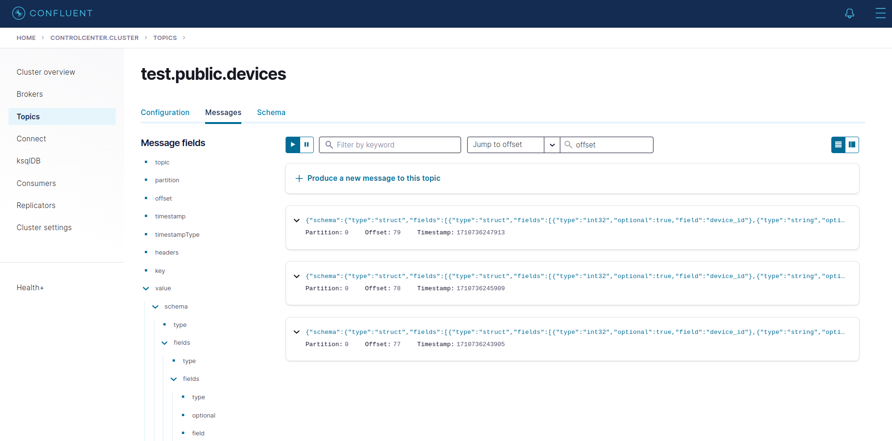
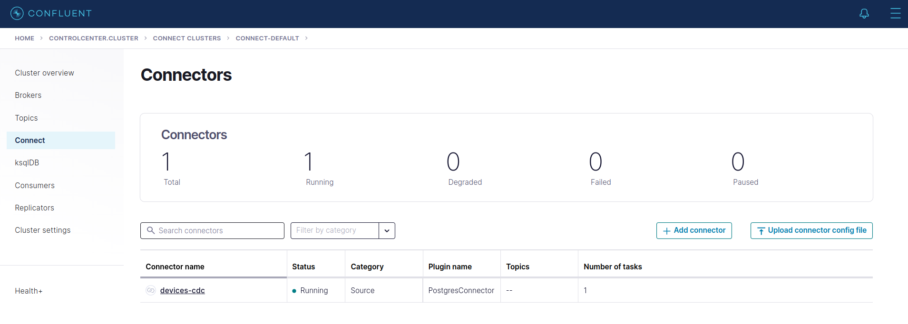

# How-to Guide

## Provision the infrastructure
```shell
docker compose -f docker-compose up -d
```
## Register connectors
Connect Debezium with PostgreSQL to receive any updates from the database
```shell
bash streaming_demo/run.sh register_connector configs/postgresql-cdc.json
```

You should see the output similar to the below example
```shell
Registering a new connector from configs/postgresql-cdc.json
HTTP/1.1 201 Created
Date: Mon, 18 Mar 2024 04:26:52 GMT
Location: http://localhost:8083/connectors/devices-cdc
Content-Type: application/json
Content-Length: 370
Server: Jetty(9.4.44.v20210927)

{"name":"devices-cdc","config":{"connector.class":"io.debezium.  connector.postgresql.PostgresConnector","database.hostname":"po    stgresql","database.port":"5432","database.user":"k6","database    .password":"k6","database.dbname":"k6","plugin.name":"pgoutput"    ,"database.server.name":"test","table.include.list":"public.dev    ices","name":"devices-cdc"},"tasks":[],"type":"source"}
```

## Initialize the database
```shell
# Create an empty table in PostgreSQL
python streaming_demo/utils/create_table.py
# Periodically insert a new record to the table
python streaming_demo/utils/insert_table.py
```

## Observe new records on Kafka

Access the `control center` at the address `http://localhost:9021/` to see the new records


You can also verify whether your CDC connecter has been registered successfully in `control center`
