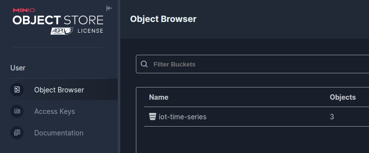

# How-to Guide

## Start our data lake infrastructure
```shell
docker compose -f docker-compose.yml -d
```

## Generate data and push them to MinIO
```shell
conda create -n dl python=3.9
conda activate dl
pip install -r requirements.txt
```
### 1. Generate data
```shell
python utils/generate_fake_data.py
```
After running this script, you should see another folder `data` folder with the following structure:
```shell
data/
└── pump
    ├── part_0.parquet
    ├── part_1.parquet
    └── part_2.parquet
```

### 2. Push data to MinIO
```shell
python utils/export_data_to_datalake.py
```
Please note that besides using the script, you can definitely upload manually the data, however it is not recommended!

After pushing the data to MinIO, access `MinIO` at 
`http://localhost:9001/`, you should see your data already there.


## Create data schema
After putting your files to `MinIO`, please execute `trino` container by the following command:
```shell
docker exec -ti datalake-trino bash
```

When you are already inside the `trino` container, typing `trino` to in an interactive mode

After that, run the following command to register a new schema for our data:

```sql
---Create a new schema to store tables
CREATE SCHEMA IF NOT EXISTS mle.iot_time_series
WITH (location = 's3://iot-time-series/');

---Create a new table in the newly created schema
CREATE TABLE IF NOT EXISTS mle.iot_time_series.pump (
  event_timestamp TIMESTAMP,
  pressure DOUBLE,
  velocity DOUBLE,
  speed DOUBLE
) WITH (
  external_location = 's3://iot-time-series/pump',
  format = 'PARQUET'
);
```

**Note:** Instead of going into the `trino` container, you can also execute the queries on `DBeaver`.

## Query with DBeaver
1. Install `DBeaver` as in the following [guide](https://dbeaver.io/download/)
2. Connect to our database (type `trino`) using the following information (empty `password`):
  
3. Execute your queries on DBeaver

## Query multiple sources with DBeaver
1. Connect to our `metastore` database, and create a new table using the following query
```sql
-- Create the pump table
CREATE TABLE "offline-fs".public.pump (
    event_timestamp TIMESTAMP,
    pressure DOUBLE,
    velocity DOUBLE,
    speed DOUBLE
);

-- Insert 5 mock data entries
INSERT INTO "offline-fs".public.pump (event_timestamp, pressure, velocity, speed) VALUES
(TIMESTAMP '2024-07-14 08:30:00', 120.5, 5.2, 15.7),
(TIMESTAMP '2024-07-14 09:00:00', 115.3, 5.5, 14.9),
(TIMESTAMP '2024-07-14 09:30:00', 110.8, 5.1, 14.5),
(TIMESTAMP '2024-07-14 10:00:00', 112.4, 5.3, 15.1),
(TIMESTAMP '2024-07-14 10:30:00', 118.2, 5.4, 15.6);
```

2. Union join 2 tables from `mle` and `offline-fs` catalogs
```sql
SELECT * FROM mle.iot_time_series.pump 
UNION ALL
SELECT * FROM "offline-fs".public.pump;
```